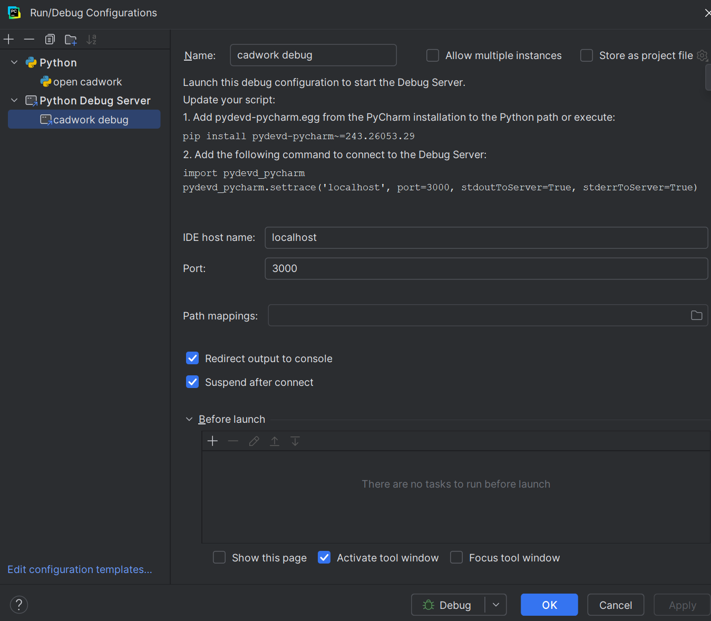
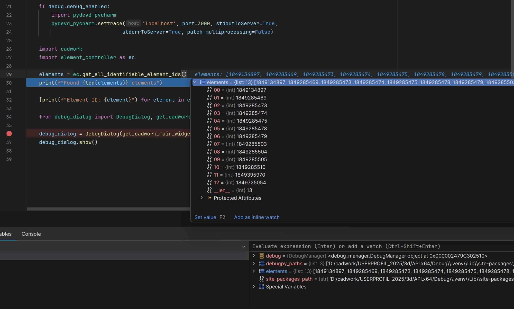

# Remote Debugging Python Scripts in cadwork

[PyCharm remote-debug-config](https://www.jetbrains.com/help/pycharm/remote-debugging-with-product.html#remote-debug-config)


<br>
<br>



# Symbolic Link Creation Instructions (if your cadwork API directory is not in the same directory as your Python scripts)

This explains how to create a symbolic link from a directory (in my case `Debug`) to the cadwork API directory (
`D:\cadwork\userprofil_2025\3d\API.x64`).

## Why create a symbolic link?

Creating a symbolic link allows you to develop Python scripts in this directory while making them directly accessible
in the cadwork API directory without duplicating files.

## Instructions

Using Command Prompt (Administrator)
Press `Win + X` and select "Command Prompt (Admin)"
Run the following command:

```bash
mklink /D "D:\cadwork\userprofil_2025\3d\API.x64\Debug" "D:\source\Python\Debug"
```

```bash
C:\Users\MichaelBrunner>mklink /D "D:\cadwork\userprofil_2025\3d\API.x64\Debug" "D:\source\Python\Debug"
symbolic link created for D:\cadwork\userprofil_2025\3d\API.x64\Debug <<===>> D:\source\Python\Debug
```

Using PowerShell (Administrator)
Press `Win + X` and select "Windows PowerShell (Admin)"
Run the following command:

```powershell
New-Item -ItemType SymbolicLink -Path "D:\cadwork\userprofil_2025\3d\API.x64\Debug" -Target "D:\source\Python\Debug"
```

## Verifying the link

After creating the symbolic link, any file placed in this directory will be accessible from the cadwork API directory,
and vice versa.

## Removing the link

If you need to remove the symbolic link:

```bash
rmdir "D:\cadwork\userprofil_2025\3d\API.x64\Debug"
```

# PyQt (for building GUI's)

PyQt is a set of Python bindings for The Qt Company’s Qt application framework.
PyQt is available in cadwork, so you don't need to install it separately for running the scripts.
You have to install it for the development process.

```bash
pip install PyQt5
```

[GUI Programming With PyQt](https://realpython.com/learning-paths/pyqt-gui-programming/)

[Python and PyQt: Building a GUI Desktop Calculator](https://realpython.com/python-pyqt-gui-calculator/)

Create the UI file using Qt Designer and convert it to Python code using the `pyuic5` command.

```bash
pyuic5 debug_dialog.ui -o ui_debug_dialog.py
```
